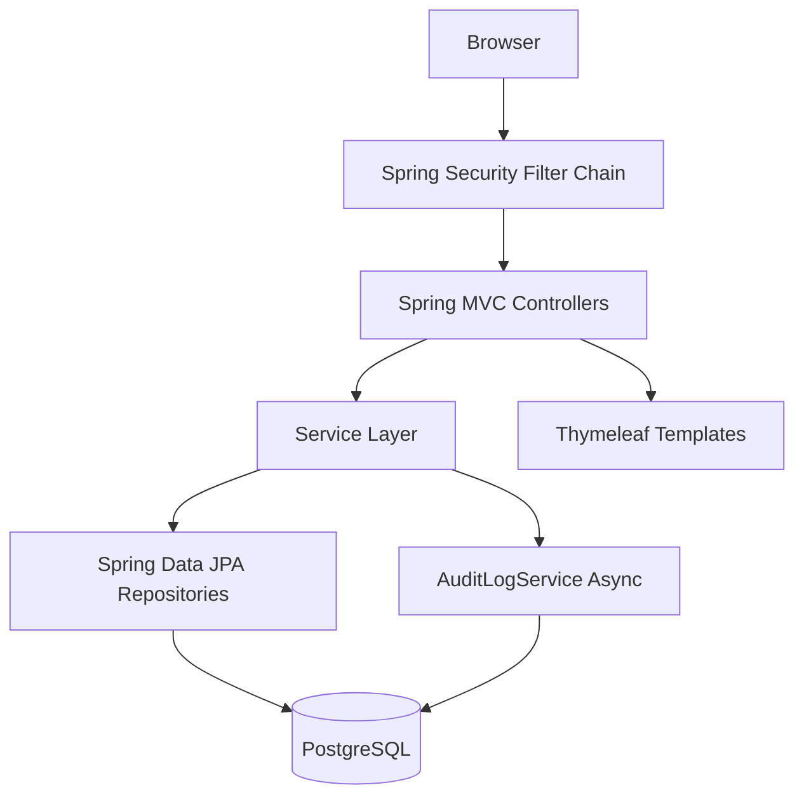
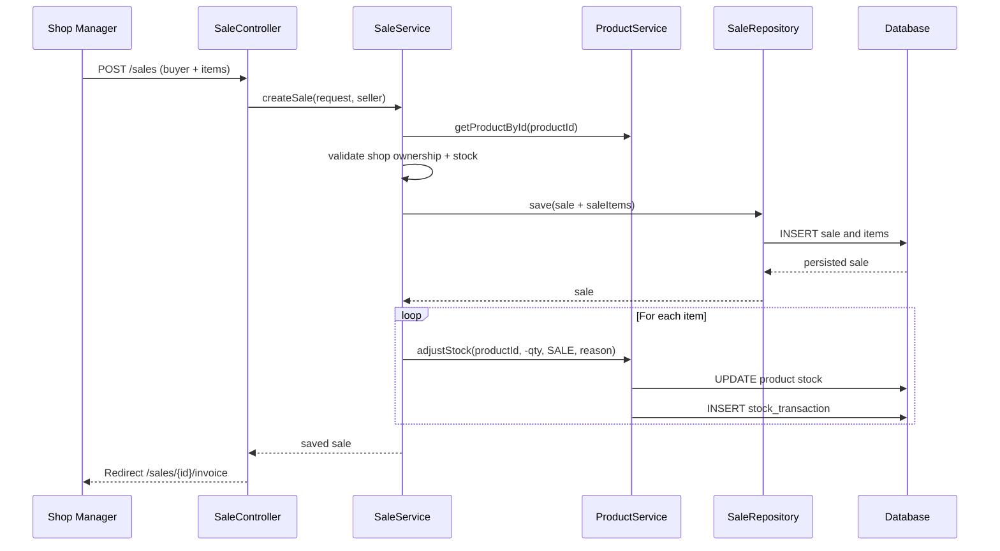
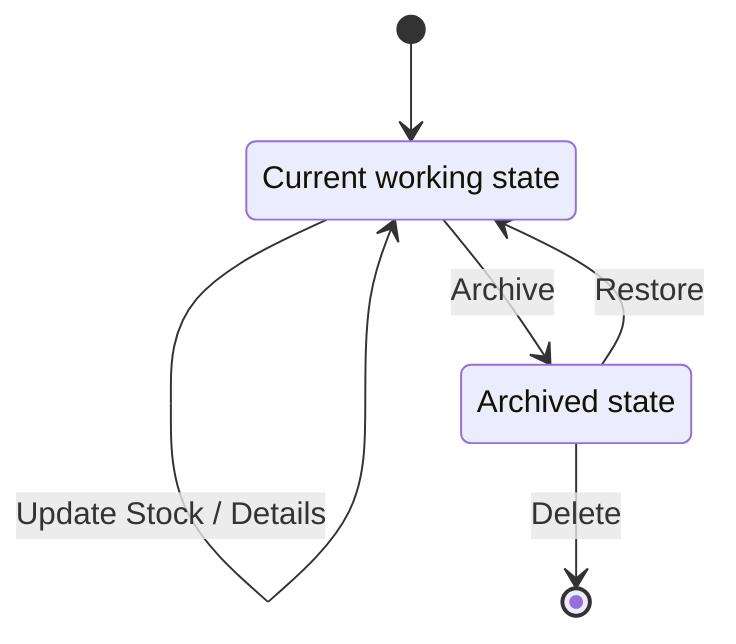
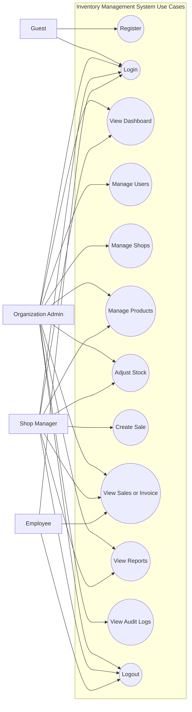
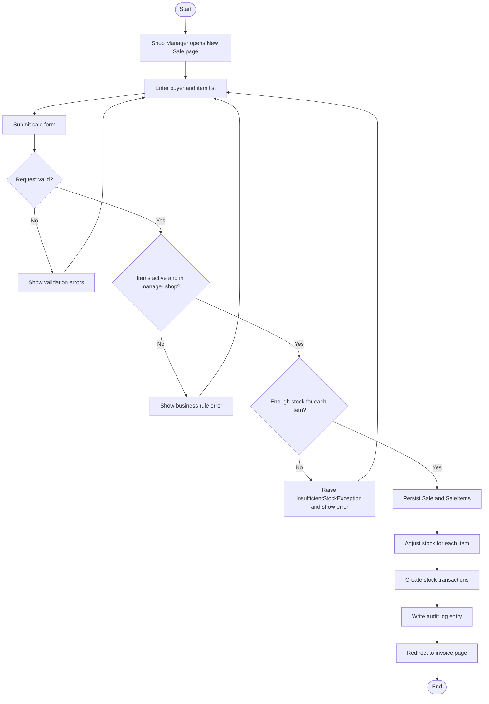
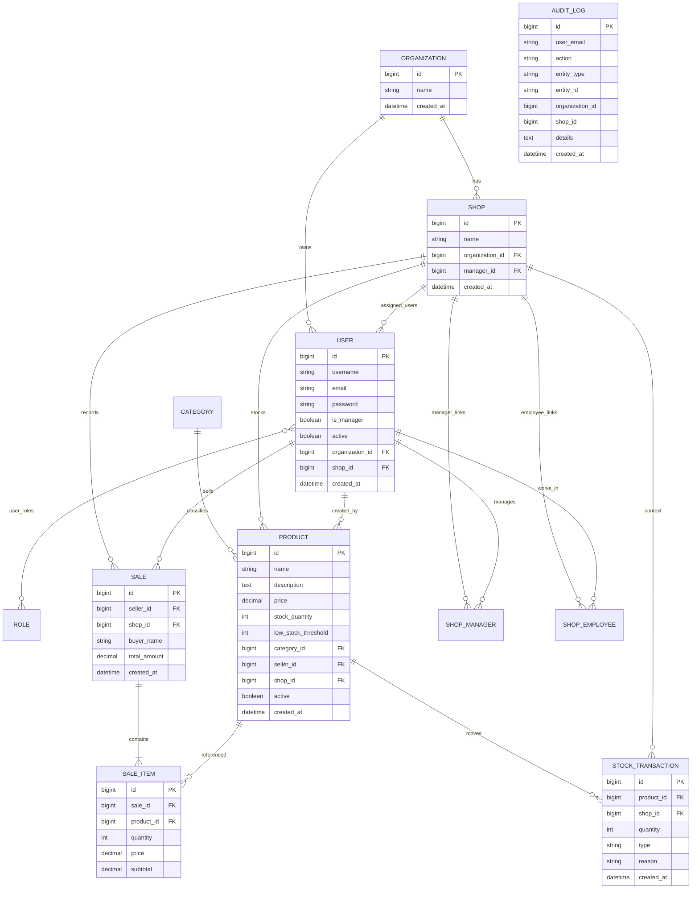
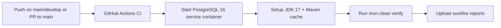

# Inventory Management System

[](https://www.java.com/)
[](https://spring.io/projects/spring-boot)
[](https://maven.apache.org/)
[](https://www.thymeleaf.org/)
[](https://www.docker.com/)

A Spring Boot inventory and sales platform with role-based access for **Organization Admin**, **Shop Manager**, and **Employee** users.

## Live Demo

Public URL is [Inventory Management App](https://inventory-management-app-nzpq.onrender.com/auth/login).

---

## Table of Contents

- [Project Description](#project-description)
- [Architecture](#architecture)
- [Use Case Diagram](#use-case-diagram)
- [Activity Flow Diagram](#activity-flow-diagram)
- [ER Diagram](#er-diagram)
- [Cardinality Matrix](#cardinality-matrix)
- [Features](#features)
- [Role & Access Matrix](#role--access-matrix)
- [Endpoint Inventory (MVC)](#endpoint-inventory-mvc)
- [Tech Stack](#tech-stack)
- [Test Inventory](#test-inventory)
- [Run Instructions (Docker)](#run-instructions-docker)
- [Render Deployment](#render-deployment)
- [CI/CD Explanation](#cicd-explanation)
- [Pipeline](#pipeline)
- [Branch Strategy](#branch-strategy)
- [Project Structure](#project-structure)
- [Notes](#notes)

---

## Project Description

This system manages inventory, shop operations, and sales in an organization that can contain multiple shops.

- **Organization Admins** can manage organizations, shops, staff accounts, products, reports, and audit logs.
- **Shop Managers** can manage their shop's products and employees, create sales, and view reports scoped to their shop.
- **Employees** can create sales and manage products/categories for their assigned shop, while being blocked from users, reports, audit logs, and shop management.

Core goals:

- Clear Spring MVC + Service + Repository layered architecture.
- Server-rendered UI using Thymeleaf templates.
- Persistent storage with Spring Data JPA and PostgreSQL.
- Audit-friendly operations through asynchronous action logging.
---

## Architecture

The project follows a layered Spring Boot architecture:

1. **View Layer** - Thymeleaf templates for auth, dashboard, admin, products, sales, and reports.
2. **Controller Layer** - Handles HTTP requests, role checks, and model binding.
3. **Service Layer** - Implements business rules (organization/shop scoping, stock checks, sales constraints).
4. **Repository Layer** - Spring Data JPA repositories for querying persistence.
5. **Model Layer** - JPA entities define inventory, sales, user, and audit domain state.



### Sales + Stock Update Flow



### Product Lifecycle (Soft Delete + Stock Adjustments)



---

## Use Case Diagram



## Activity Flow Diagram



PlantUML source for both diagrams is available at [docs/uml/usecase-activity.puml](docs/uml/usecase-activity.puml).

---

## ER Diagram

Current JPA model maps to these primary tables:

- `organizations`
- `shops`
- `users`
- `roles`
- `user_roles` (join table)
- `categories`
- `products`
- `sales`
- `sale_items`
- `stock_transactions`
- `audit_logs`
- `shop_managers`
- `shop_employees`




---
## Cardinality Matrix

Explicit relationship cardinalities used in this project:

| Relationship | Cardinality | Implemented Via |
|---|---|---|
| Organization -> Shop | 1 : M | `shops.organization_id` |
| Organization -> User | 1 : M | `users.organization_id` |
| Shop -> User (active membership) | 1 : M | `users.shop_id` |
| User -> Shop (active membership) | M : 1 | `users.shop_id` |
| User <-> Role | M : M | `user_roles` join table |
| Category -> Product | 1 : M | `products.category_id` |
| Shop -> Product | 1 : M | `products.shop_id` |
| User -> Product (seller) | 1 : M | `products.seller_id` |
| Shop -> Sale | 1 : M | `sales.shop_id` |
| User -> Sale (seller) | 1 : M | `sales.seller_id` |
| Sale -> SaleItem | 1 : M | `sale_items.sale_id` |
| Product -> SaleItem | 1 : M | `sale_items.product_id` |
| Product -> StockTransaction | 1 : M | `stock_transactions.product_id` |
| Shop -> StockTransaction | 1 : M | `stock_transactions.shop_id` |
| Shop -> ShopManager (assignment log) | 1 : M | `shop_managers.shop_id` |
| User -> ShopManager (assignment log) | 1 : M | `shop_managers.user_id` |
| Shop -> ShopEmployee (assignment log) | 1 : M | `shop_employees.shop_id` |
| User -> ShopEmployee (assignment log) | 1 : M | `shop_employees.user_id` |

Active access scope uses `users.shop_id`, so each user has one active shop at a time.

Cardinality notation in the ER diagram:

- `||` = exactly one
- `o|` = zero or one
- `|{` = one or many
- `o{` = zero or many

---

## Features

- Form-based registration and login under `/auth/*`.
- Automatic organization creation for newly registered accounts.
- Role-aware dashboard with product/sales/revenue/low-stock metrics.
- Product CRUD with organization/shop access boundaries.
- Soft delete for products (`active=false`) instead of hard delete.
- Stock adjustment workflow with transaction history (`RESTOCK`, `INCREASE`, `DECREASE`, `SALE`).
- Sales creation with invoice generation and stock deduction.
- Reporting for sales, inventory, and seller activity (scoped by user role).
- Staff management (create/edit/toggle/reset password).
- Shop assignment flows for managers and employees.
- Asynchronous audit logging for key write operations.
- Custom error pages for `400`, `401`, `403`, `404`, and `500` with fallback error rendering.
- Graceful MVC exception handling via global exception handler.

---

## Role & Access Matrix

| Capability | EMPLOYEE | SHOP_MANAGER | ORGANIZATION_ADMIN |
|---|---|---|---|
| Login/Register | Yes | Yes | Yes |
| Dashboard | Redirects to sales | Yes | Yes |
| View Sales | Yes (shop-scoped) | Yes (shop-scoped) | Yes (organization-scoped) |
| Create Sales | Yes (shop-scoped) | Yes (shop-scoped) | No |
| Manage Products | Yes (assigned shop) | Yes (assigned shop) | Yes (organization shops) |
| Manage Categories | Yes | Yes | Yes |
| Manage Shops | No | Limited (employee assignment only) | Yes |
| Manage Users | No | Limited | Full |
| View Reports | No | Yes (shop-scoped) | Yes (organization-scoped) |
| View Audit Logs | No | No | Yes |

---

## Endpoint Inventory (MVC)

This project currently uses controller-based MVC routes and server-rendered templates. There are no dedicated `/api/*` REST controllers in the codebase at this time.

### Auth & Common

| Method | Path | Access | Description |
|---|---|---|---|
| GET | `/` | Authenticated | Dashboard entry/redirect |
| GET | `/dashboard` | Authenticated | Dashboard entry/redirect |
| GET | `/auth/login` | Public | Login page |
| POST | `/auth/login` | Public | Login processing (Spring Security form login) |
| GET | `/auth/register` | Public | Registration page |
| POST | `/auth/register` | Public | Register new account |
| POST | `/auth/logout` | Authenticated | Logout |

### Admin & Staff Management

| Method | Path | Access | Description |
|---|---|---|---|
| GET | `/admin/users` | SHOP_MANAGER, ORGANIZATION_ADMIN | User list (scoped by role) |
| GET | `/admin/users/new` | SHOP_MANAGER, ORGANIZATION_ADMIN | New user form |
| POST | `/admin/users/new` | SHOP_MANAGER, ORGANIZATION_ADMIN | Create user |
| GET | `/admin/users/{id}/edit` | ORGANIZATION_ADMIN | Edit user form |
| POST | `/admin/users/{id}/edit` | ORGANIZATION_ADMIN | Update user |
| POST | `/admin/users/{id}/toggle` | ORGANIZATION_ADMIN | Activate/deactivate user |
| POST | `/admin/users/{id}/reset-password` | ORGANIZATION_ADMIN | Reset user password |
| GET | `/admin/logs` | ORGANIZATION_ADMIN | Audit logs |

### Organization Management

| Method | Path | Access | Description |
|---|---|---|---|
| GET | `/organizations` | ORGANIZATION_ADMIN | List organization scope |
| GET | `/organizations/new` | ORGANIZATION_ADMIN | New organization form |
| POST | `/organizations` | ORGANIZATION_ADMIN | Create organization |
| GET | `/organizations/{id}/edit` | ORGANIZATION_ADMIN | Edit organization form |
| POST | `/organizations/{id}/edit` | ORGANIZATION_ADMIN | Update organization |
| POST | `/organizations/{id}/delete` | ORGANIZATION_ADMIN | Delete organization |

### Shop Management

| Method | Path | Access | Description |
|---|---|---|---|
| GET | `/shops` | SHOP_MANAGER, ORGANIZATION_ADMIN | List accessible shops |
| GET | `/shops/new` | ORGANIZATION_ADMIN | New shop form |
| POST | `/shops` | ORGANIZATION_ADMIN | Create shop |
| GET | `/shops/{id}/edit` | ORGANIZATION_ADMIN | Edit shop form |
| POST | `/shops/{id}/edit` | ORGANIZATION_ADMIN | Update shop |
| POST | `/shops/{id}/delete` | ORGANIZATION_ADMIN | Delete shop |
| POST | `/shops/{shopId}/assign-manager/{userId}` | ORGANIZATION_ADMIN | Assign manager to shop |
| POST | `/shops/{shopId}/assign-employee/{userId}` | SHOP_MANAGER, ORGANIZATION_ADMIN | Assign employee to shop |
| GET | `/shops/{id}/employees` | SHOP_MANAGER, ORGANIZATION_ADMIN | List shop employees |

### Category Management

| Method | Path | Access | Description |
|---|---|---|---|
| GET | `/categories` | EMPLOYEE, SHOP_MANAGER, ORGANIZATION_ADMIN | Category list |
| GET | `/categories/new` | EMPLOYEE, SHOP_MANAGER, ORGANIZATION_ADMIN | Create form |
| POST | `/categories` | EMPLOYEE, SHOP_MANAGER, ORGANIZATION_ADMIN | Create category |
| GET | `/categories/{id}/edit` | EMPLOYEE, SHOP_MANAGER, ORGANIZATION_ADMIN | Edit form |
| PUT | `/categories/{id}` | EMPLOYEE, SHOP_MANAGER, ORGANIZATION_ADMIN | Update category |
| DELETE | `/categories/{id}` | EMPLOYEE, SHOP_MANAGER, ORGANIZATION_ADMIN | Delete category |

### Product Management

| Method | Path | Access | Description |
|---|---|---|---|
| GET | `/products` | EMPLOYEE, SHOP_MANAGER, ORGANIZATION_ADMIN | Product list (+search, scoped by role) |
| GET | `/products/new` | EMPLOYEE, SHOP_MANAGER, ORGANIZATION_ADMIN | Create form |
| POST | `/products` | EMPLOYEE, SHOP_MANAGER, ORGANIZATION_ADMIN | Create product |
| GET | `/products/{id}/edit` | EMPLOYEE, SHOP_MANAGER, ORGANIZATION_ADMIN | Edit form |
| PUT | `/products/{id}` | EMPLOYEE, SHOP_MANAGER, ORGANIZATION_ADMIN | Update product |
| DELETE | `/products/{id}` | EMPLOYEE, SHOP_MANAGER, ORGANIZATION_ADMIN | Soft delete product |
| GET | `/products/{id}/stock` | EMPLOYEE, SHOP_MANAGER, ORGANIZATION_ADMIN | Stock adjustment form |
| PATCH | `/products/{id}/stock` | EMPLOYEE, SHOP_MANAGER, ORGANIZATION_ADMIN | Apply stock adjustment |

### Sales

| Method | Path | Access | Description |
|---|---|---|---|
| GET | `/sales` | EMPLOYEE, SHOP_MANAGER, ORGANIZATION_ADMIN | Sales list |
| GET | `/sales/new` | EMPLOYEE, SHOP_MANAGER | New sale form |
| POST | `/sales` | EMPLOYEE, SHOP_MANAGER | Create sale + invoice |
| GET | `/sales/{id}` | EMPLOYEE, SHOP_MANAGER, ORGANIZATION_ADMIN | Sale detail |
| GET | `/sales/{id}/invoice` | EMPLOYEE, SHOP_MANAGER, ORGANIZATION_ADMIN | Printable invoice |

### Reports

| Method | Path | Access | Description |
|---|---|---|---|
| GET | `/reports/sales` | SHOP_MANAGER, ORGANIZATION_ADMIN | Sales report (`from`, `to`) |
| GET | `/reports/inventory` | SHOP_MANAGER, ORGANIZATION_ADMIN | Inventory report |
| GET | `/reports/seller-activity` | SHOP_MANAGER, ORGANIZATION_ADMIN | Seller activity report |

---

## Tech Stack

| Layer | Technology |
|---|---|
| Language | Java 17 |
| Framework | Spring Boot 3.2.3 |
| Web | Spring MVC |
| View | Thymeleaf + Thymeleaf Security Extras |
| Security | Spring Security 6 |
| Validation | Jakarta Bean Validation |
| Persistence | Spring Data JPA / Hibernate |
| Database | PostgreSQL (runtime), H2 (test profile) |
| Build Tool | Maven |
| Utilities | Lombok, Spring Boot DevTools |
| Testing | JUnit 5, Spring Boot Test, Spring Security Test, Mockito |
| Containerization | Docker multi-stage build + Docker Compose |
| Deployment | Render blueprint (`render.yaml`) |

---

## Test Inventory

Current test assets under `src/test/java`:

- **Total test classes:** 8
- **Total `@Test` methods:** 42
- **Controller test classes:** 4 (`AuthControllerTest`, `OrganizationControllerTest`, `ProductControllerTest`, `ShopControllerTest`)
- **Service test classes:** 4 (`OrganizationServiceTest`, `ProductServiceTest`, `SaleServiceTest`, `UserServiceTest`)

Notes:

- Two controller tests use Spring context + MockMvc (`@SpringBootTest`, `@AutoConfigureMockMvc`).
- The remaining tests are Mockito-based unit tests.
- CI currently excludes controller tests via `-Dtest=!**/*ControllerTest`.

---

## Run Instructions (Docker)

### 1. Clone and enter the project

```bash
git clone <your-repo-url>
cd Inventory_Themed_Software_Project
```

### 2. Configure environment variables

Copy `.env.example` to `.env` and set values:

```env
DB_NAME=inventory_db
DB_USERNAME=postgres
DB_PASSWORD=your_secure_password_here
```

### 3. Build and run with Docker Compose

```bash
docker compose up --build
```

Services:

- App: `http://localhost:8095`
- PostgreSQL: `localhost:5490`

### 4. Stop services

```bash
docker compose down
```

### 5. Reset database (optional)

Use `scripts/reset_db.sql` against the running PostgreSQL container, then restart the app.

---

## Render Deployment

This repository includes `render.yaml` with two services:

1. `inventory-db` (PostgreSQL service)
2. `inventory-management-app` (Docker web service)

### Required environment variables (Render)

- `DATABASE_URL` (from Render DB connection string)
- `DB_USERNAME` (from Render DB user)
- `DB_PASSWORD` (from Render DB password)
- `SPRING_PROFILES_ACTIVE=prod`
- Optional: `JAVA_OPTS`

### Deployment Summary

1. Connect repository in Render.
2. Ensure `Dockerfile` is used for build.
3. Provision PostgreSQL service.
4. Map DB env vars to web service.
5. Deploy and verify `/` health check route.

---

## CI/CD Explanation

CI is configured in `.github/workflows/ci.yml`.

### Trigger Rules

- `push` on `main` and `develop`
- `pull_request` targeting `main`

### CI Job Details

- Runner: `ubuntu-latest`
- Service container: `postgres:16`
- Test DB config:
  - `POSTGRES_DB=inventory_test`
  - `POSTGRES_USER=postgres`
  - `POSTGRES_PASSWORD=password`

### CI Steps

1. Checkout repository (`actions/checkout@v4`)
2. Set up JDK 17 + Maven cache (`actions/setup-java@v4`)
3. Run tests (`mvn clean verify -Dtest=!**/*ControllerTest`)
4. Upload surefire reports as artifact (`actions/upload-artifact@v4`)

---

## Pipeline



---

## Branch Strategy

- `main` for stable releases

Branch protection:

- Protected `main` in GitHub settings.
- Disabled direct push to `main`.
- Requires PR approval before merge.


---

## Project Structure

```text
.
├── docker-compose.yml
├── Dockerfile
├── pom.xml
├── render.yaml
├── scripts/
│   └── reset_db.sql
├── src/
│   ├── main/
│   │   ├── java/com/inventory/
│   │   │   ├── config/
│   │   │   ├── controller/
│   │   │   ├── dto/
│   │   │   ├── exception/
│   │   │   ├── model/
│   │   │   ├── repository/
│   │   │   ├── security/
│   │   │   └── service/
│   │   └── resources/
│   │       ├── application.properties
│   │       ├── application-prod.properties
│   │       ├── data.sql
│   │       └── templates/
│   └── test/
│       ├── java/com/inventory/
│       │   ├── controller/
│       │   └── service/
│       └── resources/application-test.properties
└── .github/workflows/ci.yml
```

---

## Notes

- The app is currently MVC-first (Thymeleaf pages/forms). No `/api/*` REST controller layer exists yet.
- Spring Security uses email as the username field and blocks deactivated accounts.
- Hidden HTTP method filter is enabled to support `PUT`, `PATCH`, and `DELETE` from HTML forms.
- `DataSeeder` currently truncates and reseeds core tables on startup. This is convenient for demos but risky for production data persistence.
- `spring.jpa.hibernate.ddl-auto=update` is enabled in both default and prod property files.

### Seeded Demo Credentials

The startup seeder creates demo users:

- `admin@techmart.com` / `Admin@123`
- `manager.downtown@techmart.com` / `Manager@123`
- `manager.mall@techmart.com` / `Manager@123`
- `alice@techmart.com` / `Employee@123`